# <center>Interface-de-gestion-des-ressources</center>
## <center>Dossier de conception</center>


### A) Diagramme de classe :
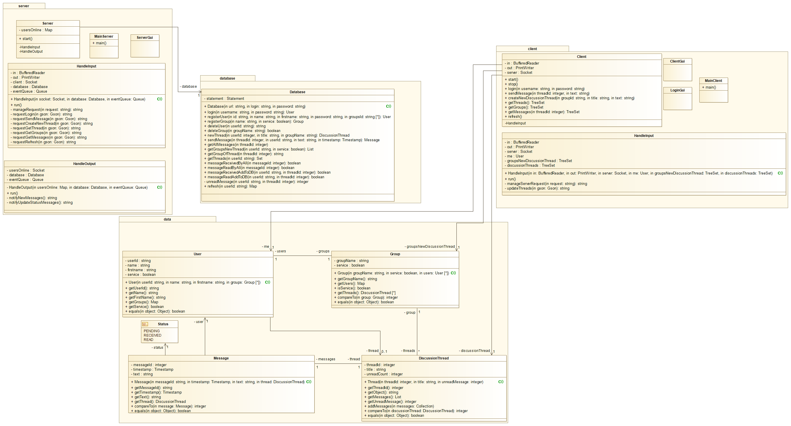
### B) Diagramme de séquence :
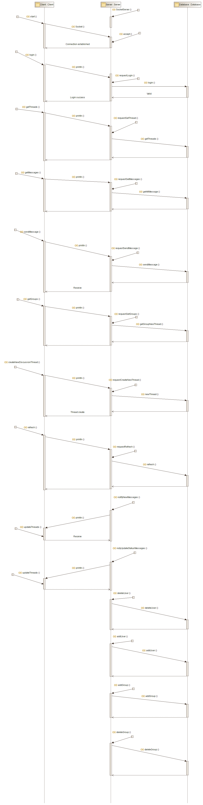
#### I) Établissement de connexion :
Login() : quand on appuie sur le bouton Login.
Socket() : quand on crée une nouvelle socket dans la partie client → envoie de demande de connexion :
accepte : quand le serveur accepte la connexion avec la primitive accept() ;

#### II) Envoie des Requête Client -> Serveur :
Pour envoyer les requêtes on va utiliser un objet PrintWriter qui prend en argument de constructeur un Socket.getOutputStream() .

Cet objet contient la méthode println qui envoie une série d’octet .

Cette série d’octet se génère on utilisant une sérialisation des objets java avec Gson qui fait une conversion des objets en Octets avec la méthode toJson.

Requête: est représenté sous forme une HashMap la première clef c’est le type de requête et les autres sont les ressources par exemple dans le cas d’un login on a une requêtes comme ça :
```
[clef = « DO » → valeur « Type De Requête »]
[clef = «ID» → valeur « identifiant »]
[clef = « PASSWORD » → valeur « mot de passe »
```

#### III) Reception des Message Serveur -> Client :

Pour recevoir les données le client va utiliser un objet BufferedReader qui prend en argument de constructeur la primitive Socket.getInputStream() .

Message :  est représenté sous forme d’un HashMap la première clef c’est le type de message “***NOUVEAUMESSAGE ou UPDATE***“

    1. cas d’un UPDATE : la valeur est la liste des données à mettre à jour par exemple :
	[Clef : UPDATE -> valeur : [GROUP]]
	[Clef : GROUP -> valeur : la nouvelle liste des goupes ]
	il peut être plusieurs données à mettre à jour


    2. cas d’un NOUVEAUMESSAGE : la valeur c’est un objet qui contient le message.


#### IV) L'actualisation : 
 Y aura deux type d’actualisation soit :

    1. Active : l’utilisation demande l’actualisation.("Refresh”)
    2. Passive : le serveur envoie automatiquement les données.

#### V) La base de donnée : 
On va utiliser un serveur local de base de données avec XAMPP.
La communication se fait par SQL en utilisant la librairie JDBC et le connecteur MySql.

MCD :
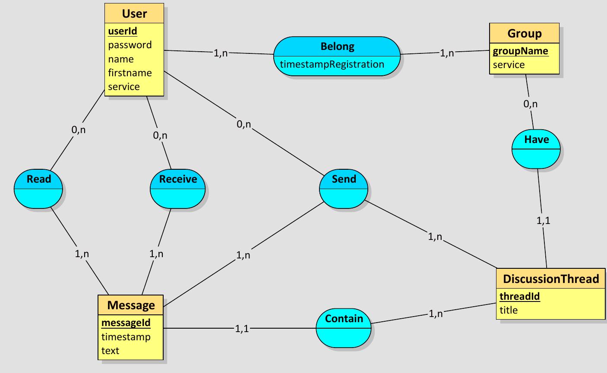

MLD :
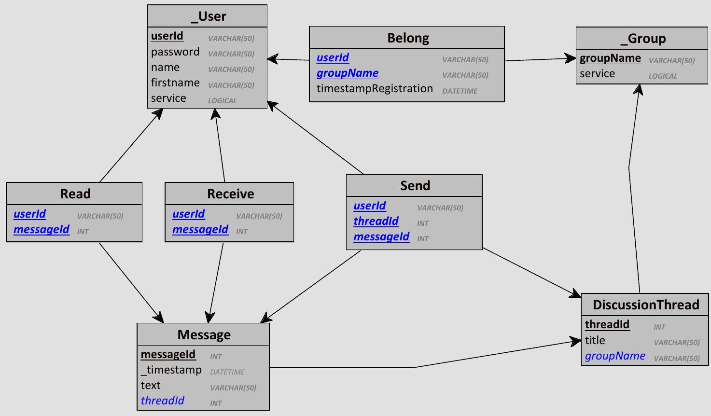

### C) Les Interfaces Graphique :

On a utilisé 3 interfaces graphique pour le client :
####  I) Interface Login :
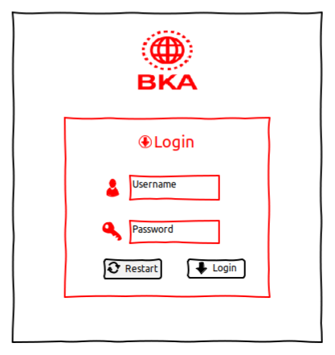
      
      Les composants : 
      - ImageIcon : JPanel et JLabel
      - Form : JPanel
      - Restart et Login : JButton
      - Saisie clavier : JTextFields
	
Quand on lance le processus client cette interface d’authentification est affiché si les informations sont correctes l’interface se ferme automatiquement pour afficher l’interface client .

#### II) Interface client :
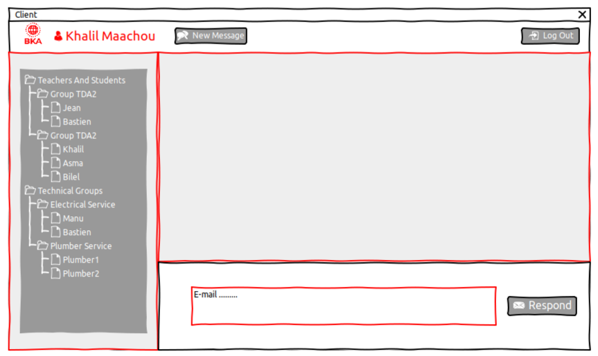

	Les composants :
     - nom de client : Jlabel
     - logo : ImageIcon
     - fil de discussions : JTree
     - messages : JTextArea, JLabel JButton
     - Log out : JButton
Le fonctionnement principale de cette interface est d’afficher les fils de discussion à gauche sous forme un arbre et à droite pour afficher le contenue d’une fil de discussion avec  un espace de saisie pour répondre au message, et quand on appuie sur le bouton log out le processus client se ferme ,par contre si on appuie sur le bouton “new thread” une autre interface va être afficher .  
	
#### III) Interface new thread:
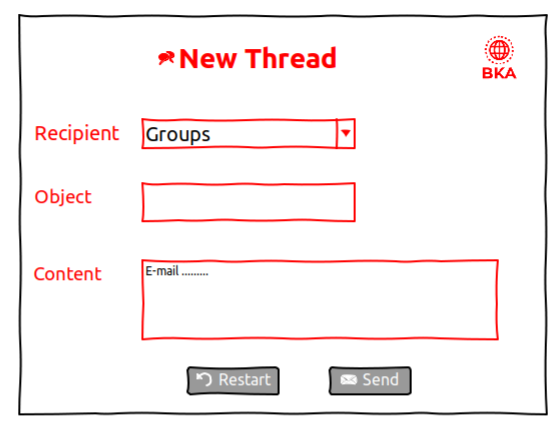

     Les composants :
     - Titre : JLabel, ImageIcon
     - Selection groupe : JTextArea, JComboBox
     - Objet : JLabel, JTextArea
     - Message : JLabel, JTextArea
D’abord un JPanel principale et à l'intérieur 5 JLabel 2 pour le titre et l'icône à droite 3 pour afficher les noms des JTextField “objet” JTextArea “message” et le JComboBox “Group”.
Cette interface nous donne la possibilité de créer et ajouter des nouvelle fil de discussions. 
	

Pour la partie serveur on a utilisé 4 interface graphique :
#### I) Server Side:
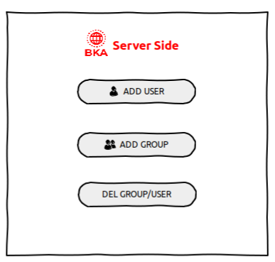

	Les composants : 
     - Titre : JLabel, ImageIcon
     - Add/del user/group : JButton
     - Disposition horizontale : GridLayout
Un thread va s'occuper de l’affichage de cette interface en parallèle des autres traitements , dans cette interface il y a 3 boutons qui définissent 2 services (qui nécessite un mot de passe admin) spécifique pour cette partie Ajout et Suppression des utilisateurs et groupes.
	
#### II) Add User:
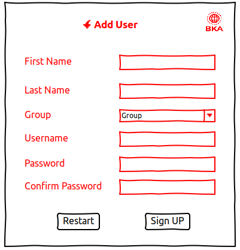

     Les composants: 
     - Disposition : GridLayout, FlowLayout
     - Titre : JLabel, ImageIcon
     - Formulaire : JLabel, JTextField, JComboBox
     - Restart, Sign UP : JButton
Cette interface est le résultat de bouton Add User qui contient un formulaire pour l’ajout des utilisateurs.
	
    
#### III) Add Group :
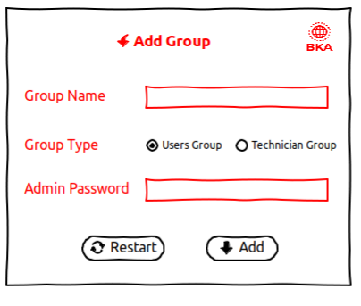

     Les composants: 
     - Disposition : GridLayout, FlowLayout
     - Titre : JLabel, ImageIcon
     - Formulaire : JLabel, JTextField, JRadioButton
     - Restart, Add : JButton 
Cette interface est le résultat de bouton Add Group qui contient aussi un formulaire pour ajouter un groupe avec le choix soit groupe utilisateur ou technicien.
	
#### IV) Delete User/Group :
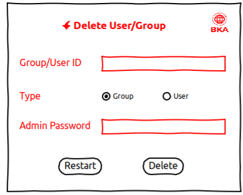

	Les composants: 
     - Disposition : GridLayout, FlowLayout
     - Titre : JLabel, ImageIcon
     - Formulaire : JLabel, JTextField, JRadioButton
     - Restart, Delete : JButton  
Quand on appuie sur le bouton Delete Group/User cette interface s’affiche qui contient un formulaire avec un choix soit utilisateur soit un groupe.
		